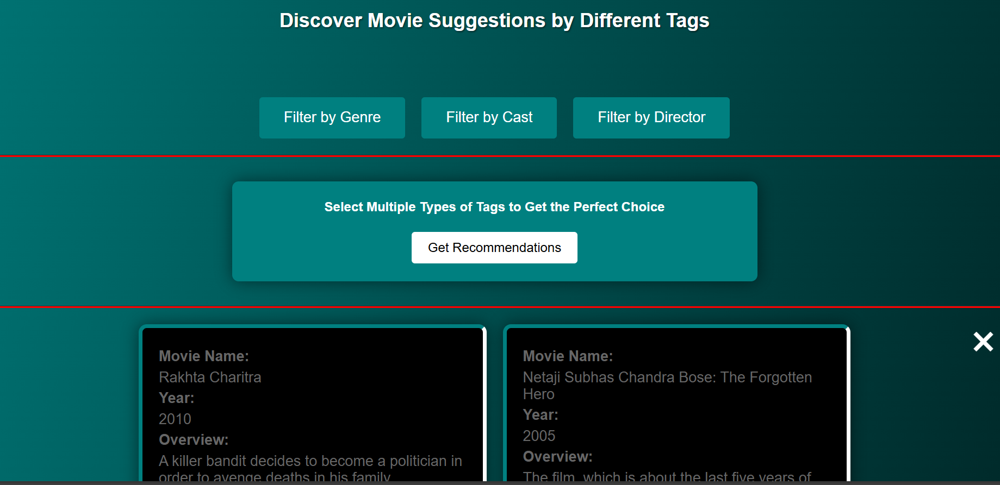

# Movie Recommendation Project

This project implements a movie recommendation system using K-Nearest Neighbors (KNN) and filtering techniques based on movie metadata.

## Overview

The project utilizes a dataset containing information about movies, including genres, cast members, directors, and release years. Two main recommendation approaches are employed:

1. **KNN-based Recommendation:**
   - Predicts movies similar to a user-provided movie using KNN algorithm based on movie features.
   - Displays top recommended movies based on similarity scores.

2. **Filtering-based Recommendation:**
   - Filters movies based on user-specified criteria such as cast members, directors, genres, and release years.
   - Ranks and displays top movies matching the filtering criteria.

## Technologies Used

- Python
- Flask (for web application)
- Pandas (for data manipulation)
- Scikit-learn (for KNN algorithm)
- HTML/CSS (for front-end templates)

## Dataset

The dataset used for this project is sourced from [IMDB-Movie-Dataset](link-to-dataset), containing detailed information about movies spanning multiple decades.

## How to Use

1. **Setup:**
   - Clone this repository to your local machine.
   - Ensure Python and required libraries are installed (`pip install -r requirements.txt`).

2. **Run the Application:**
   - Navigate to the project directory and run `python app.py`.
   - Access the application in your web browser (`http://localhost:5000` by default).

3. **Recommendation Features:**
   - **KNN-based Recommendation:**
     - Enter a movie title to find similar movies.
   - **Filtering-based Recommendation:**
     - Specify cast members, directors, genres, and release years to filter movies.

## Example Screenshots

*Screenshot of the homepage with search and filtering options.*

*Screenshot showing recommended movies based on KNN.*

## Future Enhancements

- Improve recommendation accuracy by incorporating user ratings or reviews.
- Enhance user interface with more interactive features and responsive design.

## Contributors

- Nikhil Desmukh - [@github-handle](https://github.com/nikhildeshmukh454)

